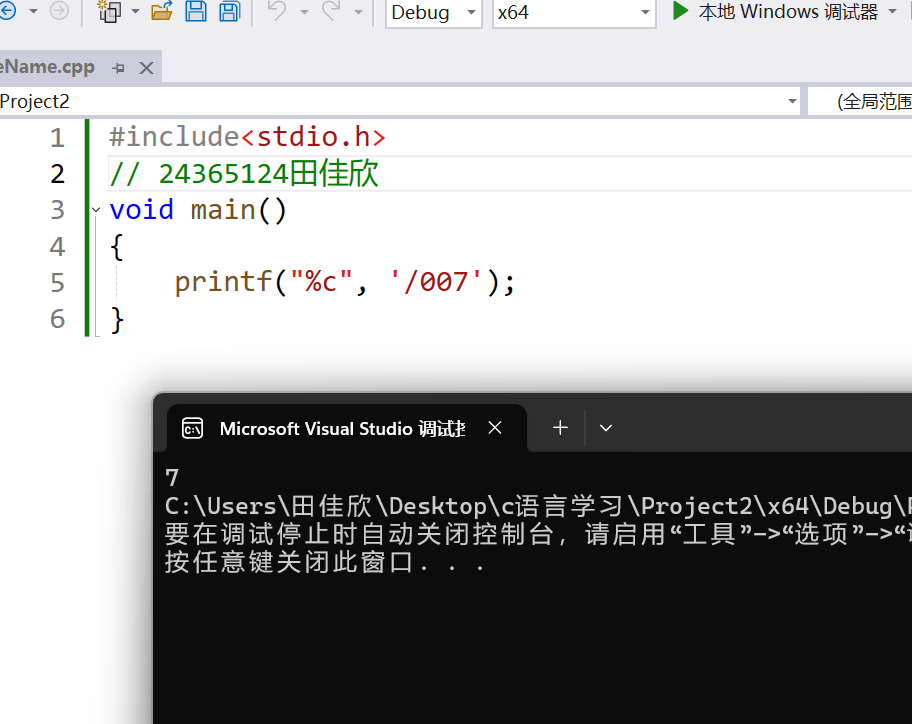
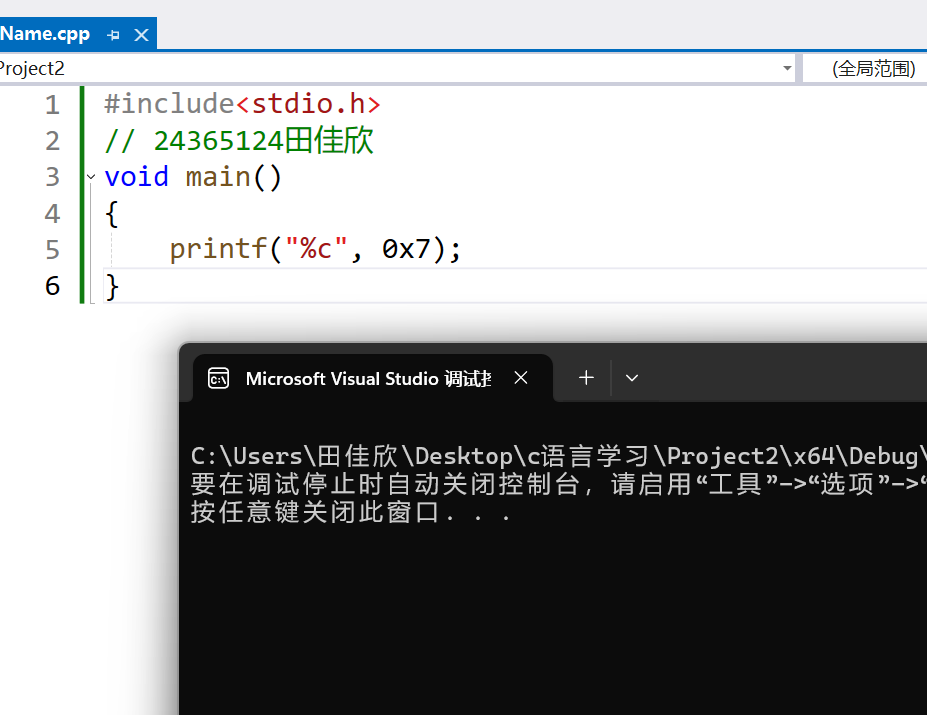

# 实验一 数据类型、运算符与表达式

## 一、实验目的

1. 了解算法的概念、特性、算法在程序设计中的地位。
2. 熟悉算法的表示方法。
3. 掌握用流程图表示一个算法。
4. 能独立设计一个问题的算法,并根据该算法编出问题的程序。
5. 掌握 C 语言数据类型，熟悉如何定义一个整型、字符型和实型变量，以及对它们赋值的方法，了解以上类型数据输出时所用的格式转换符。
6. 学会使用 C 的有关算术运算符，以及包含这些运算符的表达式，特别是自加、自减运算符的使用。
7. 进一步熟悉 C 程序的编辑、编译、连接和运行的过程。

## 二、实验准备

1. 复习算法的概念和特性。
2. 复习算法的几种表示方式。
3. 复习 C 语言的数据类型。
4. 复习各种运算符和表达式。

## 三、实验内容

1、运行程序并回答问题：

```
#include<stdio.h>
int main()｛
    printf("%c", '／007');
    return 0;
｝
```



问题:如果执行 printf("%c'＂,0x7)会得到什么结果?为什么?



答：执行printf("%c'＂,0x7)代码后，没有见到可见的字符。

因为无论是0x7，还是\007,他们所表示的ASCII码字符为DEL，这是一个不可见的字符。


 
